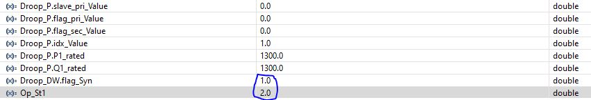
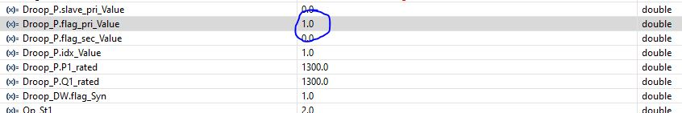
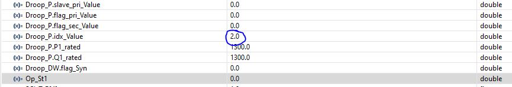
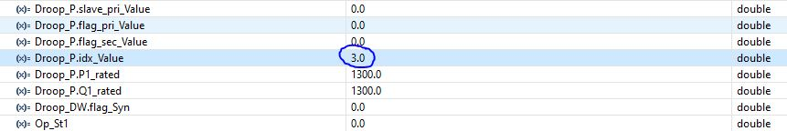
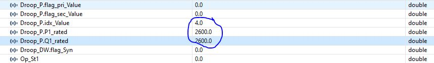
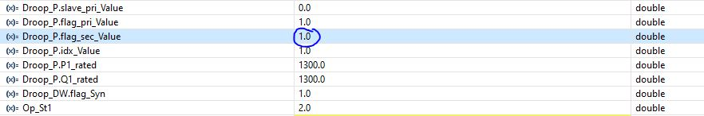

## The Hardware-in-the-loop Testbed for Microgrid based on OPAL-RT
**Author:** Jun Zhang  
**Update:** 02/23/2025 first upload 

---

## System Description
**(Important!!) See [HILSystem.pdf](https://github.com/JunZhang111/HIL_Microgrid_OPAL-RT/blob/main/HILSystem.pdf) for more details.**
- A HIL testbed for microgrid based on OPAL-RT.  

---

## Simulator

---

## Controls
- Primary Control: Droop control in [1].
- Secondary Control: Optimal distributed control in [2].
- [1] N. Pogaku, M. Prodanovic and T. C. Green, "Modeling, Analysis and Testing of Autonomous Operation of an Inverter-Based Microgrid," in IEEE Trans. Power Electron, vol. 22, no. 2, pp. 613-625, Mar. 2007.
- [2] S. M. Mohiuddin and J. Qi, "Optimal Distributed Control of AC Microgrids With Coordinated Voltage Regulation and Reactive Power Sharing," in IEEE Trans. Smart Grid, vol. 13, no. 3, pp. 1789-1800, May 2022.

---

## Software Version
- Matlab: 2020b
- RTLAB: 2023.1.0.533
- CCS: V12.7.1.00001 with compiler TI v22.6.1.LTS
---

## Required Hardware
- OPAL-RT simulator: OP5707XG
- DSP controller: four OP8666
- Others: host PC, four PC to control DSP for black start and grid synchronization
---

## Folder OPAL-RT
- **eHStest.slx**: The model for RT-LAB with OP5707XG.
- **VC707_2-EX-0001-3_5_0_817-eHSx128m_Gen4_C0D8FBCEC0D8FBCE-4F-31.conf**: the channel mapping file for OP5707XG. See the Mapping Table in block 'BIAS' of SC_Monitor for channel assignment. Note that two special DB37 cables are required. Each cable splits 32 analog channels into two 16 channels for four OP8666s.
- **Two_Level_Inverter_params.m**: The file for system initialization.
- **Circuit_4DG_LC.slx.xlsx**: The file for scenarios such as load changes.

---

## Folder DSP
- **Droop.map and Droop.out**: the compiled code for DSP CPU1 with primary control, secondary control, grid synchronization, and counterclockwise communication. 
- **VfController_zj_cpu3.map and VfController_zj_cpu3.out**: the compiled code for DSP CPU2 with clockwise communication. 
---
## Real-time Simulation Steps (Opal-rt side)
- **Please refer to the [RT-LAB tutorial video](https://www.opal-rt.com/opal_tutorial/startup-rtlab/) on OPAL-RT website**. 
---
## Real-time Simulation Steps (DSP side)
- **Code Flashing**: See [page for OP8666 on Opal-rt wiki](https://opal-rt.atlassian.net/wiki/spaces/PHDGD/pages/144718233/OP8666+DSP+Controller+Board).
- **Black Start**: Start the inverter #1 without grid synchronization,:
- 1) Set Droop_DW.flag_Syn = 1 to skip grid synchronization. 
- 2) Set Op_St1 = 2 to  run in droop mode.
- 3) Set Droop_P.flag_pri_Value = 1 to start the controller 1.

- **Grid Synchronization**: Start inverters #2, #3, and #4 with grid synchronization(plug in).
- 1) Set Droop_P.idx_Value  = 2 to define the ID of the second inverter. 

- 2) Then set Droop_P.flag_pri_Value = 1 to start the controller 2.
- 3) Set Droop_P.idx_Value  = 3 to define the ID of the third inverter. 

- 4) Then set Droop_P.flag_pri_Value = 1 to start the controller 2.
- 5) Set Droop_P.idx_Value  = 4 to define the ID of the fourth inverter. Then set Droop_P.P1_rated = 2600 Droop_P.Q1_rated = 2600 to change the power rating. 

- 6) Set Droop_P.flag_pri_Value = 1 to start the controller 4.
- Note that the grid synchronization of inverter 2,3,4 takes a certain time (around 10s).

- **Activate Secondary Control**: Activate secondary control on all the inverters.
set Droop_P.flag_sec_Value = 1 in controller 1 to activate secondary control. All the controllers will start secondary control once the first one is activated.

