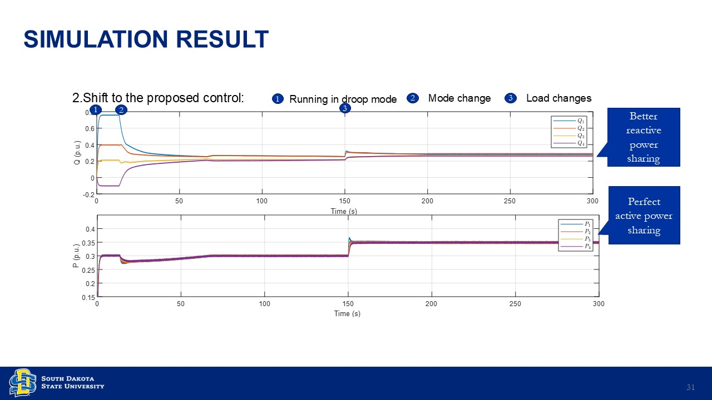

# The Hardware-in-the-loop Testbed for Microgrid based on OPAL-RT

**Author:** Jun Zhang  
**Email:** jun.zhang@jacks.sdstate.edu  
**Update:**  
- 02/23/2025 — First upload  
- 06/28/2025 — Slide update  

---

## System Description

> A HIL testbed for microgrid based on OPAL-RT.

---

## Simulator

---

## Controls

- **Primary control:** Droop control [[1]](#references)  
- **Secondary control:** Optimal distributed control [[2]](#references)  

---

## Software Version

| Software | Version |
|-----------|----------|
| **Matlab** | 2020b |
| **RTLAB** | 2023.1.0.533 |
| **CCS** | V12.7.1.00001 (TI compiler v22.6.1.LTS) |

---

## Required Hardware

- **OPAL-RT simulator:** OP5707XG  
- **DSP controller:** Four OP8666 units  
- **Communication:** optical fiber
- **Others:**  
  - Host PC  
  - Four PCs to control DSPs for black start and grid synchronization  

---

## Communication

---

## Cores Assignment

---

## Simulation: Black Start and Droop Mode

---

## Simulation: System under Optimal Control

  
  

---

## References

[1] N. Pogaku, M. Prodanovic, and T. C. Green, "Modeling, Analysis and Testing of Autonomous Operation of an Inverter-Based Microgrid," *IEEE Transactions on Power Electronics*, vol. 22, no. 2, pp. 613–625, Mar. 2007.  

[2] S. M. Mohiuddin and J. Qi, "Optimal Distributed Control of AC Microgrids With Coordinated Voltage Regulation and Reactive Power Sharing," *IEEE Transactions on Smart Grid*, vol. 13, no. 3, pp. 1789–1800, May 2022.  

---
